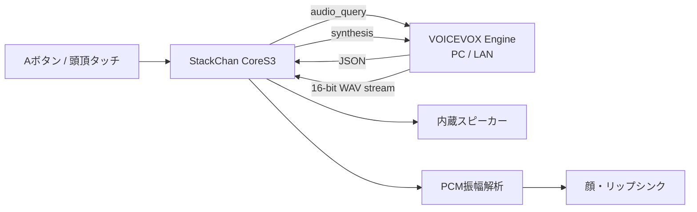

# StackChan + VOICEVOX

M5Stack StackChan（K151 / CoreS3）を、VOICEVOXで話せるデスクトップロボットにする
Arduino / PlatformIOプロジェクトです。

**現在のリリース: [β0.2.5](https://github.com/Xenoah/stackchan-codex/releases/tag/v0.2.5-beta.1)**

VOICEVOX EngineへWi-Fi経由で文章を送り、返されたWAV音声をCoreS3の
内蔵スピーカーからストリーミング再生します。再生中はPCM波形の振幅を解析し、
実際の声に合わせて口を動かします。

初期音声は「ずんだもん・ノーマル」（VOICEVOX style ID `3`）です。
顔描画には
[stack-chan/m5stack-avatar](https://github.com/stack-chan/m5stack-avatar)
v0.10.0を使用しています。

> [!IMPORTANT]
> このバージョンはβ版です。VOICEVOX Engineを動かすPCとStackChanが、
> 同じLANへ接続されている必要があります。音声合成はStackChan単体では行いません。

## できること

- VOICEVOX Engineを利用した日本語音声合成
- 16-bit PCMの実振幅に連動するリップシンク
- m5stack-avatarの全6表情
- 標準を含む全7顔テンプレート
- 5配色、5目パターン、5変形パターン
- 自動瞬き、ランダム視線、呼吸、吹き出し
- 無操作時は標準顔・通常表情へ自動復帰
- 3〜10秒のランダム間隔で自然に瞬き
- Aボタンまたは頭頂タッチによる発話
- ブラウザからのWi-Fi・VOICEVOX・発話文章設定
- 周辺Wi-Fiのスキャンと選択
- Wi-Fiの電波強度、RSSI、暗号化有無の表示
- 本体NVSへの設定保存
- 12灯RGB LEDによる状態表示
- 起動時にサーボ原点復帰を確認する安全UI
- サーボ全可動域とCoreS3 IMU水平の対話式キャリブレーション
- StackChan/CoreS3の各ハードウェアを使うための公式ライブラリ導入

## システム構成



音声は全体を保存してから再生するのではなく、2 KB × 3個のバッファへ順番に受信して
再生します。長い音声でもRAM使用量を抑えながら、受信・再生・顔描画を継続できます。

## 必要なもの

### ハードウェア

- [M5Stack StackChan K151](https://docs.m5stack.com/ja/StackChan)
- データ通信対応USB-Cケーブル
- 2.4 GHz Wi-Fiネットワーク
- VOICEVOX Engineを動かすPC

### ソフトウェア

- [Visual Studio Code](https://code.visualstudio.com/)
- [PlatformIO](https://platformio.org/)
- [VOICEVOX](https://voicevox.hiroshiba.jp/) または
  [VOICEVOX Engine](https://github.com/VOICEVOX/voicevox_engine)

## 導入

### 1. リポジトリを取得

```powershell
git clone https://github.com/Xenoah/stackchan-codex.git
cd stackchan-codex
```

### 2. ビルド

```powershell
& "$env:USERPROFILE\.platformio\penv\Scripts\pio.exe" run
```

VS CodeではPlatformIOの `Build` からも実行できます。

### 3. StackChanへ書き込み

StackChanをPCへUSB接続し、次を実行します。

```powershell
& "$env:USERPROFILE\.platformio\penv\Scripts\pio.exe" run -t upload
```

書き込みポートを指定する場合:

```powershell
& "$env:USERPROFILE\.platformio\penv\Scripts\pio.exe" run -t upload --upload-port COM4
```

接続しても認識されない場合は、microSDスロット付近のRSTボタンを約3秒長押しし、
インジケーターが緑になったら離してダウンロードモードへ入れます。

## VOICEVOX Engineの準備

### 1. LANから接続できるよう起動

StackChanから接続するため、VOICEVOX Engineをループバックアドレス
`127.0.0.1` ではなく `0.0.0.0` で待ち受けさせます。

```powershell
run.exe --host 0.0.0.0 --port 50021
```

VOICEVOXアプリ版を利用する場合は、アプリ側の設定または起動方法に従って
エンジンをLANへ公開してください。

Windows Defender Firewallが確認を表示した場合は、信頼できる
プライベートネットワークからのアクセスのみ許可してください。

### 2. PCのIPアドレスを確認

PowerShellで次を実行します。

```powershell
ipconfig
```

Wi-FiまたはEthernetのIPv4アドレスを確認します。例: `192.168.1.20`

### 3. Engineの動作確認

ブラウザで次を開き、キャラクター情報のJSONが表示されれば準備完了です。

```text
http://PCのIPアドレス:50021/speakers
```

例:

```text
http://192.168.1.20:50021/speakers
```

## StackChanの初回設定

Wi-Fi設定が未保存、または保存済みWi-Fiへ15秒以内に接続できない場合、
StackChanは設定用アクセスポイントを起動します。

1. StackChanの画面に表示された `StackChan-Setup-XXXXXX` を確認します。
2. スマートフォンまたはPCから、そのWi-Fiへ接続します。
3. Wi-Fiパスワード `stackchan` を入力します。
4. ブラウザで `http://192.168.4.1` を開きます。
5. 周辺Wi-Fi一覧から接続先を選択します。
6. Wi-Fiパスワードを入力します。
7. VOICEVOX Engineを動かすPCのIPアドレスとポートを入力します。
8. VOICEVOX style IDと、話させたい文章を入力します。
9. 「保存して再起動」を押します。

### Wi-Fi一覧

設定ページでは周辺アクセスポイントをスキャンし、次の情報を表示します。

- SSID
- 電波強度: 強・中・弱
- RSSI（dBm）
- パスワードが必要かどうか

同じSSIDは重複表示しません。「周辺Wi-Fiを再スキャン」で一覧を更新できます。
非公開SSIDは手入力欄へ入力してください。手入力したSSIDが選択リストより優先されます。

### 保存される設定

| 項目 | 初期値 |
|---|---|
| Wi-Fi SSID | 未設定 |
| Wi-Fiパスワード | 未設定 |
| VOICEVOX host | `192.168.1.2` |
| VOICEVOX port | `50021` |
| VOICEVOX style ID | `3` |
| 発話文章 | ずんだもんのサンプル文章 |

設定はESP32-S3のNVSへ保存され、ソースコードやGitには含まれません。
設定ページでは保存済みWi-Fiパスワードを再表示しません。パスワード欄を空欄で
保存した場合は、現在のパスワードを維持します。

## 操作

| 操作 | 動作 |
|---|---|
| Aボタン | 設定した文章をVOICEVOXで話す |
| Bボタン | 次の表情 |
| Cボタン | 次の顔テンプレート |
| 頭頂シングルタップ | Aボタンと同じ |
| 頭頂ダブルタップ | 次の目パターン |
| 頭頂3回以上タップ | 次の変形パターン |
| 頭頂を前方向へスワイプ | 次の配色 |
| 頭頂を後方向へスワイプ | 前の配色 |
| 頭頂を長押し | 全パターン自動ショーケース ON/OFF |

## 顔・表情エンジン

顔描画にはMITライセンスの
[M5Stack-Avatar v0.10.0](https://github.com/stack-chan/m5stack-avatar/tree/v0.10.0)
を使用しています。描画はライブラリの専用FreeRTOSタスクで継続されるため、
HTTP通信や音声再生中も瞬き・視線・呼吸アニメーションが動きます。

### 表情: 全6パターン

| 表示名 | m5stack-avatar |
|---|---|
| 喜び | `Expression::Happy` |
| 怒り | `Expression::Angry` |
| 悲しみ | `Expression::Sad` |
| 疑い | `Expression::Doubt` |
| 眠気 | `Expression::Sleepy` |
| 通常 | `Expression::Neutral` |

### 顔テンプレート: 全7パターン

- Default Face
- `SimpleFace`
- `OmegaFace`
- `GirlyFace`
- `GirlyFace2`
- `PinkDemonFace`
- `DoggyFace`

### 目: 5パターン

- 自動瞬き
- 両目開き
- 左ウィンク
- 右ウィンク
- 両目閉じ

### 配色: 5パターン

- Default
- Skin
- Cyber
- Monochrome
- Demon

### 変形: 5パターン

- Normal
- Zoom In
- Zoom Out
- Tilt Left
- Tilt Right

長押しで有効になるショーケースでは、表情、目、変形、顔テンプレート、配色を
順番に自動変更します。通常操作でも各パターンを個別に切り替えられます。

通常操作で変更した顔は5秒間表示された後、無操作状態の標準顔へ戻ります。
待機中はM5Stack-Avatar内蔵の瞬き周期ではなく、このプロジェクト独自の
スケジューラーが3〜10秒の範囲から毎回ランダムに次の瞬きを決めます。
閉眼時間は100〜180 msです。

AvatarはWi-Fi接続処理より先に起動します。保存済みWi-Fiへ接続できない場合や
設定アクセスポイントを起動している間も、標準顔を表示したまま
`SETUP: 192.168.4.1` を案内します。

VOICEVOX発話中は `Avatar::setMouthOpenRatio()` へ実際のPCM振幅を渡します。
通信成功時は通常表情へ戻り、エラー時は怒り表情と吹き出しで通知します。

### RGB LED

| 色 | 状態 |
|---|---|
| 緑 | Wi-Fi接続・発話準備完了 |
| 青 | VOICEVOXへ接続中、または発話中 |
| 赤 | VOICEVOX通信・音声処理エラー |
| 消灯 | 初期化中または設定モード |

## リップシンク

VOICEVOX Engineが返すRIFF/WAVEストリームを解析し、次の形式を再生します。

- PCM
- 16-bit
- monoまたはstereo
- 任意の有効なサンプリングレート

音声バッファごとに平均絶対振幅を求め、0〜100の口開度へ変換します。
口は約30 ms間隔で更新し、開く時は素早く、閉じる時は少し滑らかに追従します。
通信や再生が止まった場合は自動的に口を閉じます。

## ハードウェア対応状況

「使用中」はβ0.1.0の通常動作で利用している機能、
「準備済み」は公式ライブラリを導入し、今後の機能から呼び出せる状態を表します。

| デバイス / 機能 | 状態 | 用途 |
|---|---|---|
| CoreS3 LCD | 使用中 | 顔、設定案内 |
| CoreS3画面タッチ | 使用中 | A/B/C相当の顔・発話操作 |
| CoreS3スピーカー | 使用中 | VOICEVOX音声再生 |
| CoreS3デュアルマイク | 準備済み | 録音、音声認識向け |
| BMI270 IMU | 準備済み | 加速度・ジャイロ |
| BMM150 | 準備済み | 地磁気 |
| RTC | 準備済み | 時計、タイマー起動 |
| AXP2101 | 使用中 | CoreS3電源管理 |
| GC0308カメラ | 準備済み | 画像・人物検出向け |
| LTR553 | 準備済み | 近接・環境光 |
| microSD | 準備済み | 音声・設定・画像保存向け |
| X/Yサーボ | 使用中 | 起動時確認後、選択時のみ低速で原点復帰 |
| 12灯RGB LED | 使用中 | 状態表示 |
| 頭頂3ゾーンタッチ | 使用中 | 発話トリガー |
| INA226 | 準備済み | ボディバッテリー電圧・電流 |
| 赤外線送受信 | 準備済み | GPIO 5 / GPIO 10 |
| NFC | 準備済み | カード検出・エミュレーション |
| Wi-Fi | 使用中 | 設定・VOICEVOX通信 |
| BLE | 準備済み | ESP32 BLE Arduino |
| USB / GPIO / UART / I2C | 準備済み | 拡張機能 |

共通インポートとピン定義は
[`include/hardware_features.h`](include/hardware_features.h) にあります。

### サーボの安全設定

公式StackChan BSPは初期化時にサーボ電源を有効化します。このプロジェクトでは
初期化直後に次の処理を行い、不意な動作を防いでいます。

```cpp
M5StackChan.Motion.setTorqueEnabled(false);
M5StackChan.setServoPowerEnabled(false);
```

起動するたびに液晶へ `SERVO STARTUP` 画面を表示します。

- 左側の `NO / KEEP`: 移動命令を出さず、保存済みの原点補正を引き継いで起動
- 中央の `OK / HOME`: 現在の実機角度を同期してから低速で原点 `(0, 0)` へ移動
- 右側の `CAL / ALL`: サーボ2軸の原点・全可動域とIMU水平を順番に校正

`OK / HOME` を選ぶ前に、首の周囲へケーブルや手などの干渉物がないことを確認して
ください。原点復帰の完了後、または12秒のタイムアウト後は、サーボのトルクと電源を
再びOFFにします。Y軸は機構へ負担をかけない範囲で使用してください。

### 全キャリブレーション

`CAL / ALL` は次の順番で進みます。

1. トルクOFF状態で、手でYaw中央・Pitch基準位置へ合わせる
2. `SET HOME` で両軸の原点をStackChan BSPのNVSへ保存
3. `START` 後、Yaw `-128.0°`、`+128.0°`、中央復帰、Pitch `90.0°`、HOME `(0, 0)` まで低速で連続検証
4. 左右端点のフィードバック値と、Pitch `90.0°` を `stack_cal` 名前空間へ保存
5. サーボ電源をOFFにし、本体全体を水平な場所へ静置
6. BMI270ジャイロを8秒間校正し、300サンプルの加速度平均から水平の
   Roll/Pitchゼロ点を保存

サーボ移動前の確認は `SERVO 2/7` の `START` だけです。START後は最後のHOMEまで自動で進みます。
左右端点からPitch上げへ移る前は、必ずYaw中央・Pitch基準位置へ戻ってから次へ進みます。
Pitch `90.0°` は、上向き姿勢で10秒経過してサーボが停止していればP90完了として扱います。
移動中に画面へ触れると緊急停止します。HOMEへ戻れない場合、30秒以内に移動が落ち着かない場合、
IMUが動いた場合は失敗として電源・トルクをOFFにします。

サーボ起動確認画面とキャリブレーション画面は `M5Canvas` へ描画してから一括転送し、
全画面更新時のちらつきを抑えています。

## 使用ライブラリ

主要依存は [`platformio.ini`](platformio.ini) で固定しています。

| ライブラリ | バージョン / 参照 |
|---|---|
| M5Unified | `0.2.17` |
| M5GFX | M5Unified依存 |
| M5Stack-Avatar | `0.10.0` |
| StackChan-BSP | `1.1.0` |
| M5CoreS3 | `1.0.1` |
| IRremoteESP8266 | StackChan-BSP依存 |
| M5Unit-NFC | StackChan-BSP依存 |

StackChan-BSP 1.1.0はC++14以降を必要とするため、本プロジェクトはC++17で
ビルドします。PlatformIOのArduino-ESP32安定版とのUARTクロック名の差は
`UART_SCLK_DEFAULT=UART_SCLK_APB` で互換化しています。

## プロジェクト構成

```text
stackchan-codex/
├─ include/
│  └─ hardware_features.h   全ハードウェア用インポートとピン定義
├─ src/
│  ├─ main.cpp              操作、状態管理、リップシンク
│  ├─ AvatarFaceController.* 全表情・顔・目・配色・変形
│  ├─ ConfigPortal.*        Wi-FiスキャンとWeb設定画面
│  └─ VoiceVoxClient.*      VOICEVOX API、WAV解析、音声再生
├─ platformio.ini           CoreS3ビルド設定と依存ライブラリ
├─ CHANGELOG.md             リリース履歴
├─ THIRD_PARTY_NOTICES.md   利用ライブラリの著作権・ライセンス
└─ README.md
```

## シリアルモニター

通信エラーや接続先を確認できます。

```powershell
& "$env:USERPROFILE\.platformio\penv\Scripts\pio.exe" device monitor --baud 115200
```

VOICEVOXエラー時は、次のような内容を出力します。

```text
VOICEVOX error: audio_query HTTP -1
VOICEVOX error: synthesis HTTP 404
VOICEVOX error: invalid WAV RIFF header
```

## トラブルシュート

### 設定用Wi-Fiが見つからない

- StackChanを再起動してください。
- 保存済みWi-Fiへ接続できた場合、設定用アクセスポイントは起動しません。
- 設定をやり直す場合はNVSを消去するか、接続先Wi-Fiを一時的に停止してください。

### 周辺Wi-Fi一覧が空

- 「周辺Wi-Fiを再スキャン」を押してください。
- ESP32-S3は2.4 GHz Wi-Fiを利用します。5 GHz専用SSIDは表示されません。
- 非公開SSIDは手入力してください。

### 赤いLEDになり、話さない

- VOICEVOX Engineが起動しているか確認してください。
- Engineが `0.0.0.0:50021` で待ち受けているか確認してください。
- StackChanとPCが同じLANにいるか確認してください。
- PCのIPアドレスがDHCPで変わっていないか確認してください。
- Windows Firewallでプライベートネットワーク通信を許可してください。
- `http://PCのIP:50021/speakers` を別端末から開いて確認してください。

### HTTP 422になる

VOICEVOXに存在しないstyle IDを指定している可能性があります。
`/speakers` の応答から使用したいスタイルの `id` を確認してください。

### 音が途切れる

- Wi-Fi電波の強い場所へ移動してください。
- PCのCPU負荷を下げてください。
- VOICEVOX Engineを有線LANのPCで動かすと改善する場合があります。

### 書き込みに失敗する

- データ通信対応USB-Cケーブルを使用してください。
- 正しいCOMポートを指定してください。
- RSTボタン長押しでダウンロードモードへ入れてください。

## β0.1.0の既知の制限

- VOICEVOX Engineは別のPCまたはサーバーが必要です。
- 発話する文章は設定画面で登録した1件です。
- 音声認識と会話AIは未実装です。
- サーボは起動時の原点復帰のみ実装済みです。通常時の首振り操作は未実装です。
- カメラ、マイク、NFC、IR等はライブラリ準備済みですが、
  通常操作へはまだ割り当てていません。
- Wi-Fi設定を強制的に開く専用ボタン操作は未実装です。
- HTTPSのVOICEVOX接続には対応していません。信頼できるLAN内で使用してください。

## 今後の候補

- マイク入力からの音声認識
- LLMとVOICEVOXを組み合わせた対話
- 発話に合わせた首振り・うなずき
- カメラによる顔追従
- NFCカードごとのアクション
- IR家電操作
- Web画面からの自由発話
- OTAアップデート

## クレジットと利用条件

- StackChan / M5Stack関連ライブラリのライセンスは各公式リポジトリを確認してください。
- 顔描画にはShinya Ishikawa氏の
  [m5stack-avatar](https://github.com/stack-chan/m5stack-avatar)
  v0.10.0（MIT License）を使用しています。
- VOICEVOXおよび各音声ライブラリを利用・公開する際は、
  [VOICEVOX公式サイト](https://voicevox.hiroshiba.jp/) と各キャラクターの
  利用規約・クレジット表記に従ってください。
- ずんだもんの利用条件は
  [東北ずん子・ずんだもんプロジェクト](https://zunko.jp/) の案内も確認してください。

音声利用時のクレジット例:

```text
VOICEVOX:ずんだもん
```

## 関連リンク

- [M5Stack StackChan公式ドキュメント](https://docs.m5stack.com/ja/StackChan)
- [StackChan-BSP](https://github.com/m5stack/StackChan-BSP)
- [M5CoreS3](https://github.com/m5stack/M5CoreS3)
- [M5Unified](https://github.com/m5stack/M5Unified)
- [M5Stack-Avatar](https://github.com/stack-chan/m5stack-avatar)
- [VOICEVOX](https://voicevox.hiroshiba.jp/)
- [VOICEVOX Engine](https://github.com/VOICEVOX/voicevox_engine)
